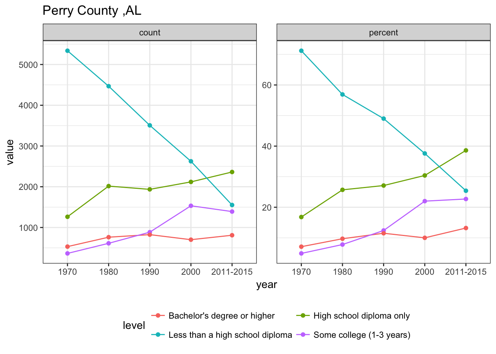
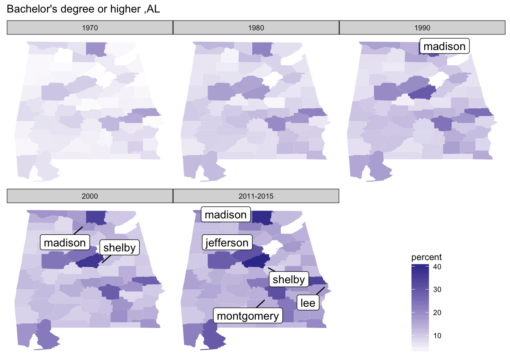

# 585project：

Team: Xiangmei Zhang, Xiangzhen Li

* Topic: Educaitonal level for adults 25+ for the US, 1970-2015.

* data source: https://catalog.data.gov/dataset/county-level-data-sets
Census Bureau, 1970, 1980, 1990, 2000 Censuses of Population, and the 2011-2015 American Community Survey 5-yr average.	

1. Obtain a tidy data
we read the excel sheet "Education.xls" in R and cleaned the data into a long tidy version. Then we checked the completeness of education levels and made the level names consistent across the year. We also redirived the precentage value of each area, education level and year to check its correctness. Next we visualized the tidy data use ggplot.

2. Edulevel package
We built a package named "Edulevel" to plot and map the data. This package contains one data set and 4 functions. data set "tidy" is the cleaned data of Education levels of adults more than 25 years old in US from 1970 to 2015. Function "showcounty" returns a list of counties for a given state abbrevation, countyname can be used in "lineEd" function, "lineEd" plots all education level lines for a given county, "mapstate" function maps the "count" or "precent" data on the scale of states in US for a given education level, "mapcounty" function maps maps the "count" or "precent" data on the scale of counties for a given state and a given education level.

```{r}
library(Edulevel)
library(tidyverse)
state.abb
```
 [1] "AL" "AK" "AZ" "AR" "CA" "CO" "CT" "DE" "FL" "GA" "HI" "ID" "IL" "IN" "IA" "KS" "KY" "LA"
[19] "ME" "MD" "MA" "MI" "MN" "MS" "MO" "MT" "NE" "NV" "NH" "NJ" "NM" "NY" "NC" "ND" "OH" "OK"
[37] "OR" "PA" "RI" "SC" "SD" "TN" "TX" "UT" "VT" "VA" "WA" "WV" "WI" "WY"

```{r}
showcounty("AL")
```
 [1] "Autauga County"    "Baldwin County"    "Barbour County"    "Bibb County"      
 [5] "Blount County"     "Bullock County"    "Butler County"     "Calhoun County"   
 [9] "Chambers County"   "Cherokee County"   "Chilton County"    "Choctaw County"   
[13] "Clarke County"     "Clay County"       "Cleburne County"   "Coffee County"    
[17] "Colbert County"    "Conecuh County"    "Coosa County"      "Covington County" 
[21] "Crenshaw County"   "Cullman County"    "Dale County"       "Dallas County"    
[25] "DeKalb County"     "Elmore County"     "Escambia County"   "Etowah County"    
[29] "Fayette County"    "Franklin County"   "Geneva County"     "Greene County"    
[33] "Hale County"       "Henry County"      "Houston County"    "Jackson County"   
[37] "Jefferson County"  "Lamar County"      "Lauderdale County" "Lawrence County"  
[41] "Lee County"        "Limestone County"  "Lowndes County"    "Macon County"     
[45] "Madison County"    "Marengo County"    "Marion County"     "Marshall County"  
[49] "Mobile County"     "Monroe County"     "Montgomery County" "Morgan County"    
[53] "Perry County"      "Pickens County"    "Pike County"       "Randolph County"  
[57] "Russell County"    "St. Clair County"  "Shelby County"     "Sumter County"    
[61] "Talladega County"  "Tallapoosa County" "Tuscaloosa County" "Walker County"    
[65] "Washington County" "Wilcox County"     "Winston County"

```{r}
lineEd("AL","Perry County")
```
<!-- -->

```{r}
mapstate(vtype="percent",levelint = 4)
```
<!-- -->

```{r}
mapcounty(levelint = 4,stateshort = "AL",limit = 30)
```
<!-- -->
